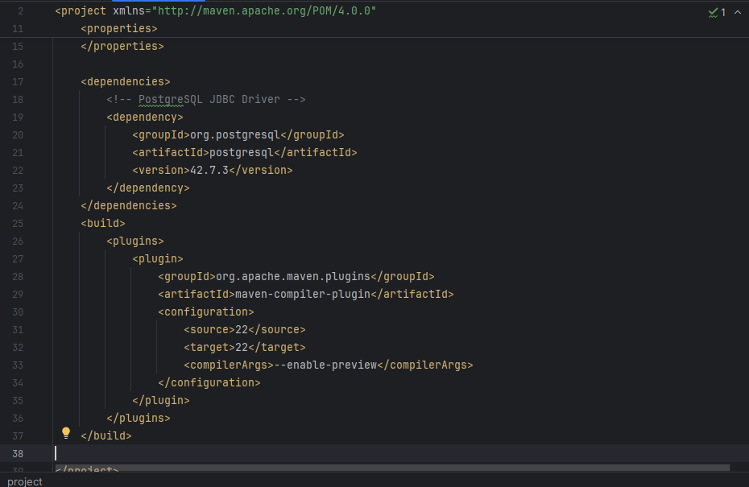
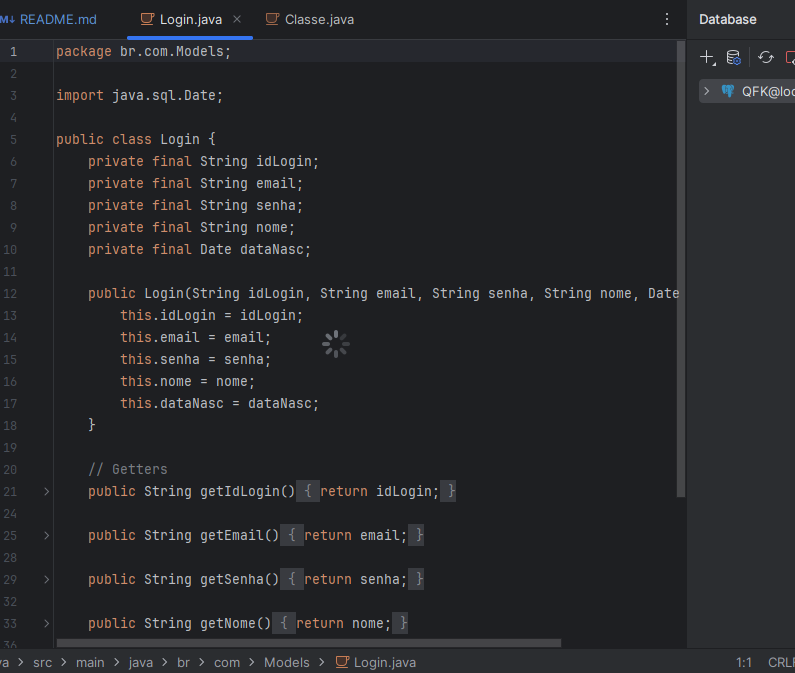
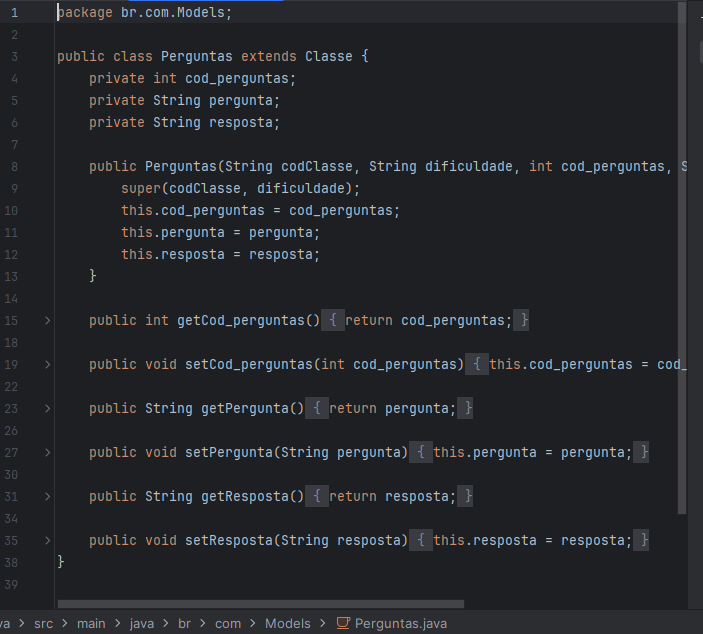
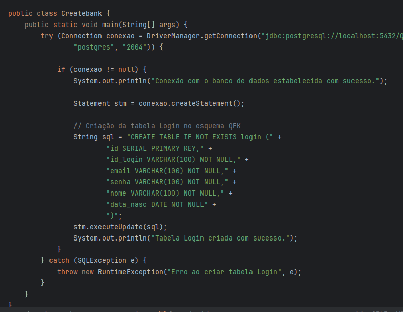
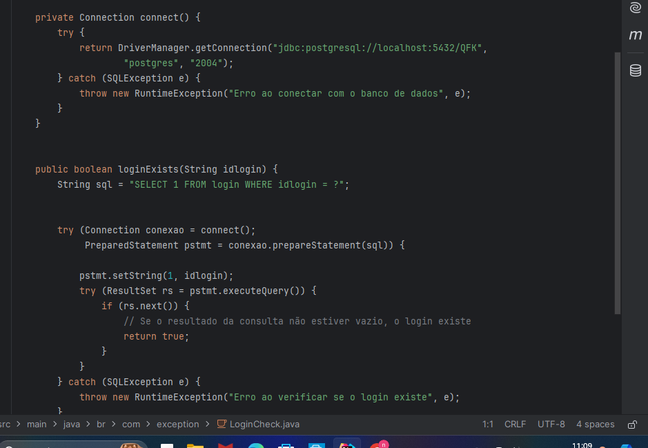
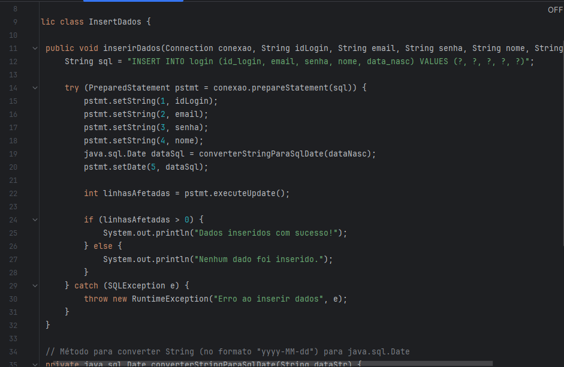
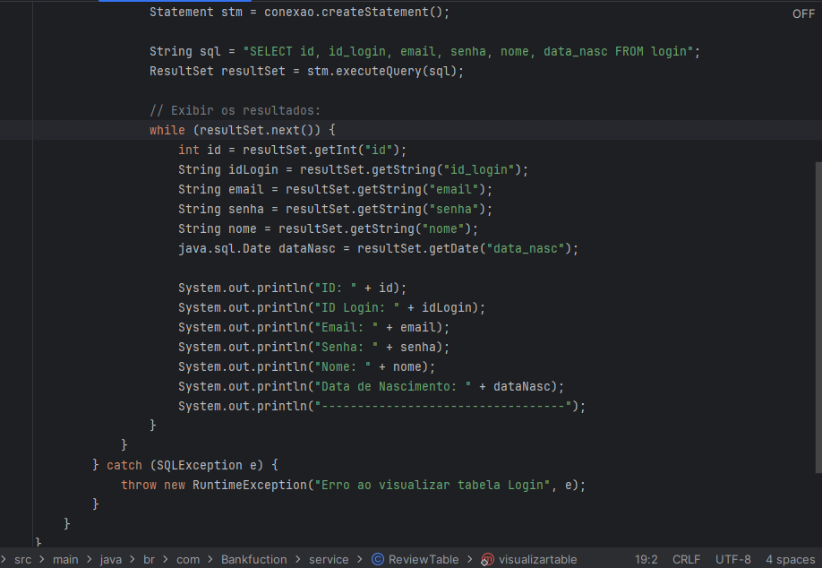
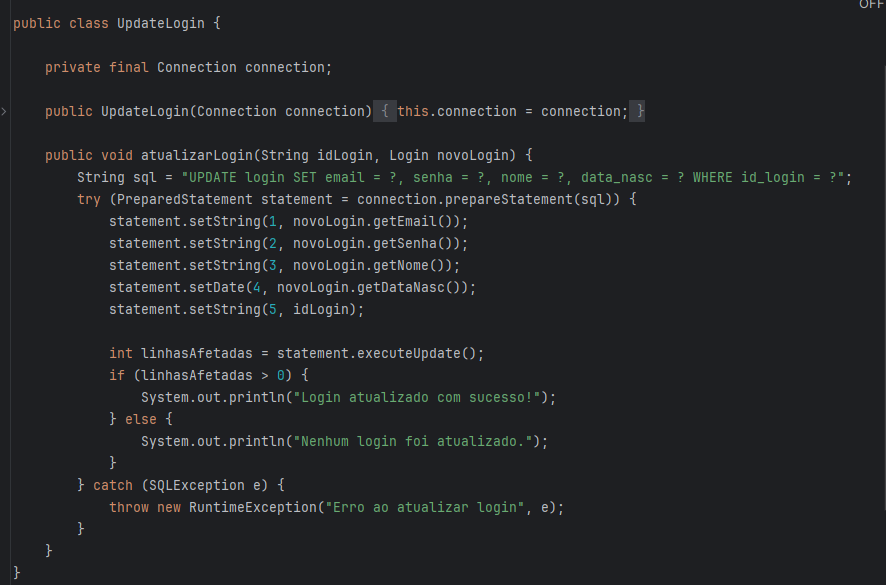
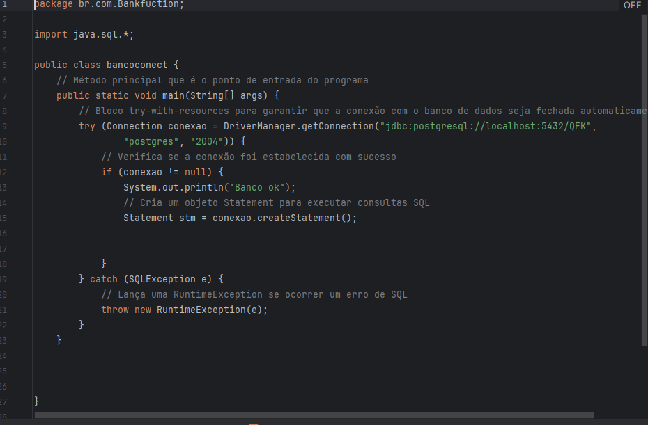

INSERÇÃO DE DRIVE DO DB, NO MAVEN:

- pom

CLASSES e suas Entidades (get and setters):
 

EXEPTIONS:
 
- criação do banco

 
- configuração de busca e retorno, 
para funcionamento correto do banco.

SERVICES:
 
- inserir dados no db.(INSERT INTO)
  
 
- deletar logins.(DELETE)
  
 
- Visualização da tabela.(SELECT FROM)

 
- Atualização de dados.(UPDATE)
  

- conexão com o db.(POSTGRES)

